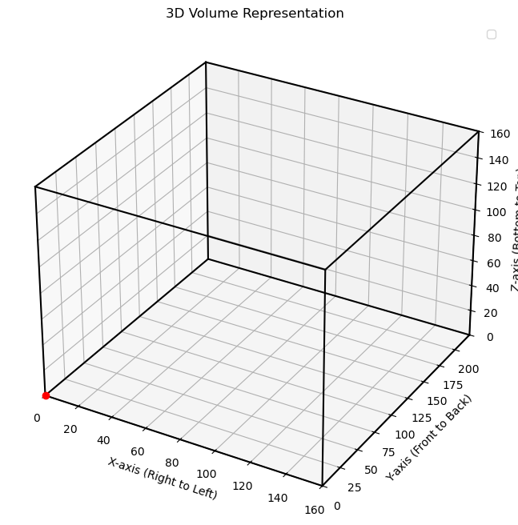
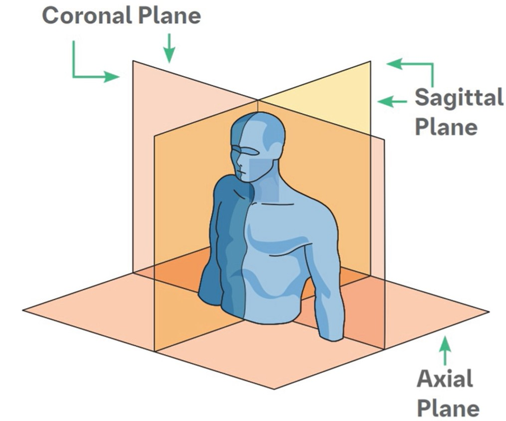

# Data Cleaning and Pre-processing Procedures

## agriVision

Reads raw images from `ROOT_DIR/raw-data/agriVision/uncleaned/`, randomly shuffles them (seeded), and splits them into 10 batches of 1,500 images. Each batch undergoes per-batch noise jitter and per-channel normalization. Processed outputs are saved as compressed `.npz` files (float32 RGB arrays, key `"image"`) to `ROOT_DIR/raw-data/agriVision/batch{idx}-agriVision-RGB-cleaned-jitter/`.

**Downstream:** set `RAW_DATA_SUFFIX="agriVision-RGB-cleaned-jitter"` and `BATCH_NUM=0..9`; load arrays via `npz_opener()`.

## coco

Reads uncropped images from `ROOT_DIR/raw-data/coco/val2017/` with annotations from `ROOT_DIR/raw-data/coco/annotations/instances_val2017.json`. Images are classified as indoor or outdoor (mutually exclusive), then randomly cropped to 256×256. Optional jitter and per-split normalization are applied. Processed outputs are saved as compressed `.npz` files (float32 RGB) to `ROOT_DIR/raw-data/coco/full-coco-indoor-cropped/`.

**Downstream:** set `RAW_DATA_SUFFIX="coco-indoor-cropped"` and point pipelines to `raw-data/coco/full-coco-indoor-cropped/`; load via `npz_opener()`.

## pastis

The notebook `data_cleaning_pastis.ipynb` renames all images in `ROOT_DIR/raw-data/pastis/uncleaned/` to `test<number>.png` and deletes files listed in `dataset-preparation/pastis/removed_data.txt`. Batch-wise noise jitter and channel normalization are then applied. Processed outputs are saved as compressed `.npz` files to `ROOT_DIR/raw-data/full-pastis-RGB-jitter/`.

**Downstream:** set `RAW_DATA_SUFFIX="pastis-RGB-jitter"`; load via `npz_opener()`.

## segmentAnything

Reads raw images from `ROOT_DIR/raw-data/segmentAnything/uncleaned/` and attempts a 512×512 random crop per image, rejecting regions detected as blurred (low Laplacian variance on 64×64 blocks, up to 100 attempts). Valid crops receive optional uniform jitter in (−0.5, 0.5) per pixel/channel, clipped to uint8. Outputs are saved as image files (original filenames and extensions) to `ROOT_DIR/raw-data/segmentAnything/segmentAnything-croppedDeblurred/`. Images that are too small or fail crop selection are skipped.

**Downstream:** set `DATASET="segmentAnything"` and `RAW_DATA_SUFFIX="segmentAnything-croppedDeblurred"`.

## spaceNet

Reads raw RGB tiles from `ROOT_DIR/raw-data/spaceNet/uncleaned/` and crops a 400×400 window centered on the non-black region. Per-batch (timestamp-based) channel mean/std normalization with small uniform jitter is applied. Processed outputs are saved as compressed `.npz` files (float32 RGB, original filename stems preserved) to `ROOT_DIR/raw-data/spaceNet/full-spaceNet-cleaned-jitter/`.

**Downstream:** set `RAW_DATA_SUFFIX="spaceNet-cleaned-jitter"`; load via `npz_opener()`.

## syntheticMRI2D

### Orientations

Three orientations are defined: axial (top to bottom), coronal (left to right), and sagittal (front to back). Each orientation is modeled separately under the assumption that orientation-specific models yield higher accuracy than a single combined model.

### Masking — `mask_images_cleaned.ipynb`

Because these are synthetic MRI images, background noise carries no anatomical information. To restrict modeling to brain tissue only, a two-step fill-holes-then-mask procedure is applied. Background intensities are not uniformly zero, and some zero-valued voxels occur within the brain, so simple thresholding is insufficient. Hole-filling preserves interior values; the subsequent mask sets all exterior values to NaN. For sagittal and coronal views, the left image border is filled prior to masking to ensure that edge-adjacent pockets are correctly included.

### Transformation

Uniform random jitter is applied after masking to avoid introducing noise into the background. Image values are then cast to float32 and normalized (excluding NaN background values) before the wavelet transform.

### Combining Directions — Horizontal (H), Vertical (V), Diagonal (D)

Kolmogorov–Smirnov tests were conducted on each pair of wavelet detail directions (HV, VD, DH) at every decomposition layer for all three orientations. KS statistics were consistently large and p-values consistently small, indicating that the directional distributions differ significantly. Overlaid PDF and CDF plots corroborate this finding: although directions converge somewhat at deeper layers, clear distributional differences persist. Horizontal and vertical coefficients are more similar to each other than to diagonal, consistent with the directional structure of brain anatomy. Directions are therefore kept separate for all orientations.

## syntheticMRI3D

### Volume Structure

Exploratory analysis in `3d_edge_detection.ipynb` confirms the layout of the MRI volumes. Each volume is stored as a 3D NumPy array with shape [Z, Y, X]. Following radiological convention, X increases right to left, Y increases front to back, and Z increases bottom to top.

### Boundary Detection — `3d_edge_detection.ipynb`

Boundary detection is performed prior to the wavelet transform. The background consists primarily of zero-valued voxels with some noise; including these values would distort the estimated distribution of brain tissue intensities. To isolate the brain, a synthetic high-intensity plane (value 5,000) is inserted at Z = 0 to seal the inferior boundary (brainstem). `binary_fill_holes` is then applied, after which the sealing plane is removed and the resulting binary mask is used to set all background voxels to NaN.

Voxel arrays must be stored as float32 (not float16) to preserve NaN values. Histograms of voxel intensities serve as a sanity check: pre-cleaning distributions exhibit a large spike at zero (background), which is absent after masking, while the brain tissue distribution remains unchanged.

### Jitter

Uniform random jitter is applied after boundary detection to ensure noise is added only to brain voxels while background values remain NaN. Jitter is applied at load time via `npz_opener_with_noise`.

### Orientation Dictionary

The 3D wavelet decomposition produces eight sub-bands labeled by three-character strings, where each character is either `a` (approximation/low-pass) or `d` (detail/high-pass), corresponding to the X (sagittal), Y (coronal), and Z (axial) axes respectively.

 *

| Label | X | Y | Z | Interpretation |
|-------|---|---|---|----------------|
| `aaa` | smooth | smooth | smooth | Coarse approximation of brain volume |
| `daa` | high-pass | smooth | smooth | Edges in the sagittal plane |
| `ada` | smooth | high-pass | smooth | Edges in the coronal plane |
| `aad` | smooth | smooth | high-pass | Edges in the axial plane |
| `dda` | high-pass | high-pass | smooth | Transitions in sagittal–coronal |
| `dad` | high-pass | smooth | high-pass | Transitions in sagittal–axial |
| `add` | smooth | high-pass | high-pass | Transitions in coronal–axial |
| `ddd` | high-pass | high-pass | high-pass | Fine structure across the full volume |

### Combining Directions

KS tests across all sub-band pairs yield large test statistics and near-zero p-values, indicating that the directional distributions are not suitable for merging. This is consistent with the 2D findings and with the expectation that each wavelet orientation captures distinct anatomical information. Directions are kept separate for both consistency with the 2D pipeline and on substantive grounds.

\* Image adapted from Boehringer Ingelheim Pharmaceuticals, Inc., "Image Reconstruction Planes," in *IPF Radiology Rounds: HRCT Primer*, 2019. Available: https://pro.boehringer-ingelheim.com/us/ipfradiologyrounds/hrct-primer/image-reconstruction